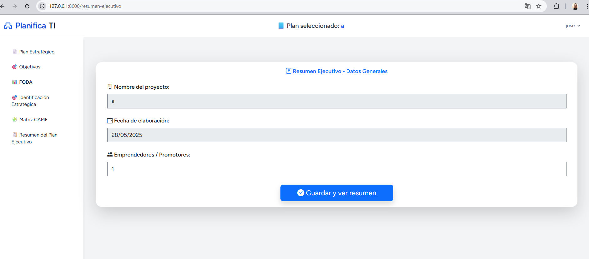
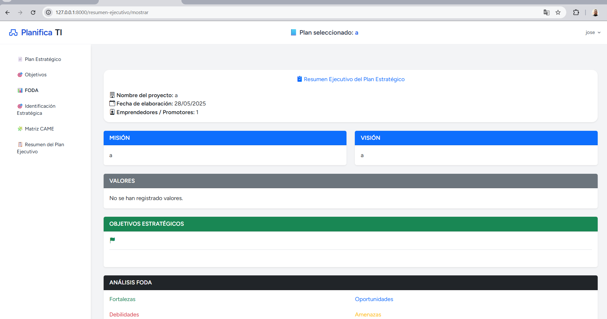

# Examen Práctica Unidad II - PETI

**Alumno:** Christian Dennis Hinojosa Mucho  
**Fecha:** {{coloca la fecha actual aquí}}

## 📝 Descripción del Proyecto

Este repositorio contiene el desarrollo del sistema **PlanificaTI**, orientado a la creación de planes estratégicos de tecnologías de información para empresas.

Como parte del examen práctico de la Unidad II, se realizaron **dos mejoras funcionales clave** dentro del sistema.

---

## ✅ Mejoras implementadas

### 1. Módulo de Resumen Ejecutivo

- Se desarrolló un nuevo módulo denominado **Resumen Ejecutivo del Plan Estratégico**.
- Este módulo centraliza y presenta automáticamente la información clave del plan:
  - Nombre del proyecto
  - Fecha de elaboración
  - Promotores del proyecto
  - Misión
  - Visión
  - Valores (decodificados como lista)
  - Objetivos estratégicos y específicos
  - Análisis FODA (Fortalezas, Oportunidades, Debilidades y Amenazas)
- Toda la información se obtiene dinámicamente desde los módulos ya existentes en la base de datos.

📌 Este módulo incluye formularios, validación y compatibilidad con sesión activa (`plan_id`), así como relaciones correctas con los modelos.

---

### 2. Mejora Visual Integral del Sistema

- Se aplicó un rediseño completo a las vistas relacionadas con el resumen ejecutivo utilizando **Bootstrap 5**:
  - Cards con sombras (`shadow-sm`, `rounded-4`)
  - Colores diferenciados por tipo de contenido
  - Badges y listados visualmente atractivos para los valores y FODA
  - Íconos informativos con [Bootstrap Icons](https://icons.getbootstrap.com/)
- Mejora la usabilidad, experiencia del usuario y presentación profesional del sistema.

---

## 📸 Capturas de pantalla

### Resumen Ejecutivo – Vista General

### mostrar

### base de datos

---

## 🔗 URL del repositorio

🔗 Repositorio público en GitHub:  
https://github.com/dennisdhm7/PE_II_EXAMEN_PRACTICO.git

---

## 🧾 Notas

- Laravel versión: 12.14.1  
- PHP: 8.2.12  
- Base de datos: MySQL  
- Requisitos adicionales: Bootstrap 5, Bootstrap Icons

